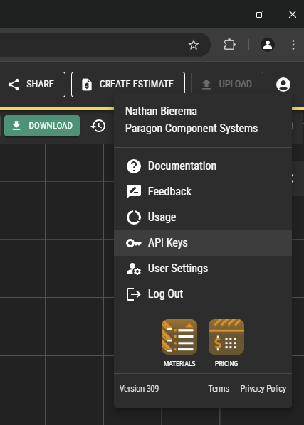

# Paragon API Sample Node.js App

## Running the sample app

1. Obtain an API key from Paragon by going to any Paragon app (e.g., https://design.paragontruss.com/), clicking on the user icon in the top-right, selecting "API Keys," and then clicking "Create New Key."

2. Set the `PARAGON_API_KEY` environment variable by creating an `.env` file in the top-level directory of this project with the contents `PARAGON_API_KEY=<your-token>`.
3. Run `npm install`
4. Run `npm start`
